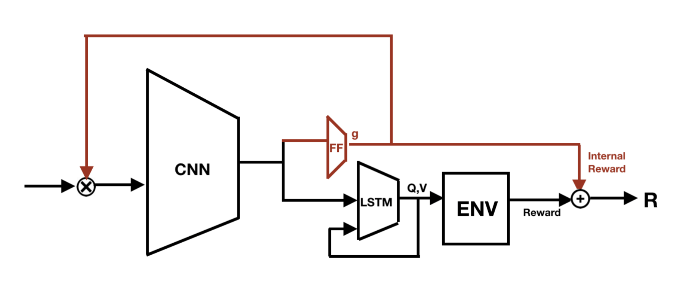
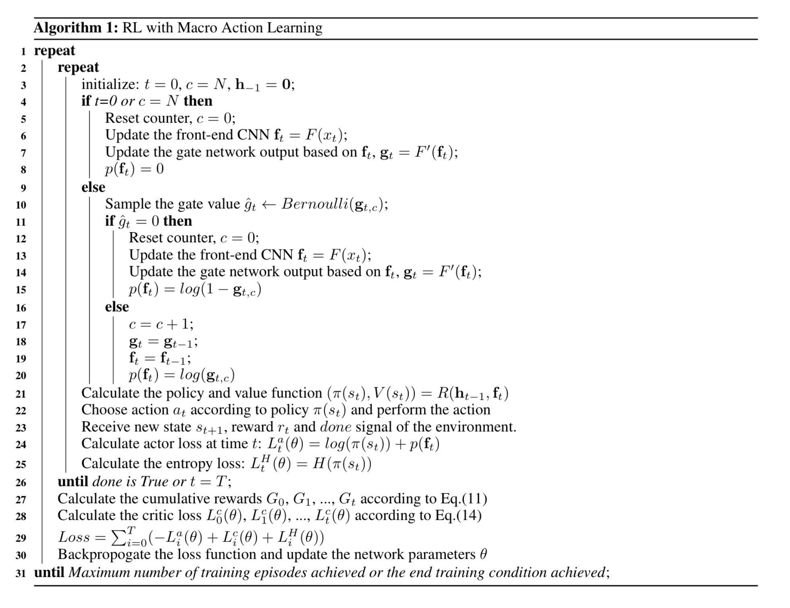
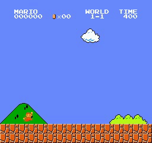
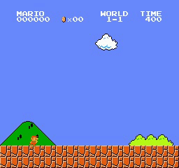

## Introduction

Here is my python source code for sequence augmented A3C. The original code is training an agent to play super mario bros.The baseline A3C is from https://github.com/nhviet1009/Super-mario-bros-A3C-pytorch.  By using Asynchronous Advantage Actor-Critic (A3C) algorithm introduced in the paper **Asynchronous Methods for Deep Reinforcement Learning** [paper](https://arxiv.org/abs/1602.01783).

Argument num_sequence is the maximum number of actions sequence without interation with environment. If it is set to 0, the code will be exactly same as original A3C.

In order to make the code run faster, you can set log_internal to a large number, say 100 or 500.

If log_internal is set to 500 and with 6 processes working in parallel, it takes about 5 hours to converge.

Argument start_initial (when it is set to "random") is to add some randomness to the environment, it is not necessary. You can set it as "reset" to get a more stable result and faster training speed. 

The test_seq.py is used to check the results after training. Make sure the all arguments in test_seq.py and train_seq.py are set to the same value.

## Motivation

Although the current RL algorithms achieve great successes in a lot of domains, they are not as efficient as a naturalhuman. Human don’t take input and make decision at each time step, for example, song and catch a ball. In currentRL, learning options and macro action is of essential importance as it can reduce computation burden and enablestructured learning, therefore it take one step closer to natural human intelligent system. In this paper, we will introduce an automatic macro action recognition method.

  

The system of the proposed system is shown in the figure above, the front end of the system is a Convolutional neural network (CNN), which is used to extract feature of the input image. After it, different from the traditional Asynchronous Advantage Actor Critic (A3C) model, we introduce a gate mechanism for macro action recognition. The gate will decide the length of current macro action. In order to use backpropogation to train the gate, we add an internal reward to the reward from environment. This internal reward is supposed to add a bonus to the long macro action. The algorithm is summarized in the following algorithm.

  

## Explanation in layman's term for A3C
If you are already familiar to reinforcement learning in general and A3C in particular, you could skip this part. I write this part for explaining what is A3C algorithm, how and why it works, to people who are interested in or curious about A3C or my implementation, but do not understand the mechanism behind. Therefore, you do not need any prerequiste knowledge for reading this part :relaxed:

If you search on the internet, there are numerous article introducing or explaining A3C, some even provide sample code. However, I would like to take another approach: Break down the name **Asynchronous Actor-Critic Agents** into smaller parts and explain in an aggregated manner.

### Actor-Critic
Your agent has 2 parts called **actor** and **critic**, and its goal is to make both parts perfom better over time by exploring and exploiting the environment. Let imagine a small mischievous child (**actor**) is discovering the amazing world around him, while his dad (**critic**) oversees him, to make sure that he does not do anything dangerous. Whenever the kid does anything good, his dad will praise and encourage him to repeat that action in the future. And of course, when the kid does anything harmful, he will get warning from his dad. The more the kid interacts to the world, and takes different actions, the more feedback, both positive and negative, he gets from his dad. The goal of the kid is, to collect as many positive feedback as possible from his dad, while the goal of the dad is to evaluate his son's action better. In other word, we have a win-win relationship between the kid and his dad, or equivalently between **actor** and **critic**.

### Advantage Actor-Critic
To make the kid learn faster, and more stable, the dad, instead of telling his son how good his action is, will tell him how better or worse his action in compared to other actions (or **a "virtual" average action**). An example is worth a thousand words. Let's compare 2 pairs of dad and son. The first dad gives his son 10 candies for grade 10 and 1 candy for grade 1 in school. The second dad, on the other hand, gives his son 5 candies for grade 10, and "punishes" his son by not allowing him to watch his favorite TV series for a day when he gets grade 1. How do you think? The second dad seems to be a little bit smarter, right? Indeed, you could rarely prevent bad actions, if you still "encourage" them with small reward.

### Asynchronous Advantage Actor-Critic
If an agent discovers environment alone, the learning process would be slow. More seriously, the agent could be possibly bias to a particular suboptimal solution, which is undesirable. What happen if you have a bunch of agents which simultaneously discover different part of the environment and update their new obtained knowledge to one another periodically? It is exactly the idea of **Asynchronous Advantage Actor-Critic**. Now the kid and his mates in kindergarten have a trip to a beautiful beach (with their teacher, of course). Their task is to build a great sand castle. Different child will build different parts of the castle, supervised by the teacher. Each of them will have different task, with the same final goal is a strong and eye-catching castle. Certainly, the role of the teacher now is the same as the dad in previous example. The only difference is that the former is busier :sweat_smile:

## Result

Here we show the comparison of the proposed framework with different action duration (N=5 and N=10) and the baseline A3C in terms of total reward and number of interaction with environment. We can see from the result, the proposed method 2 obtain both performance and computation gains. 

  

  
  
  

## How to use my code

With my code, you can:
* **Train your model** by running **python train_seq.py**
* **Test your trained model** by running **python test_seq.py**
* **mario_interaction.py** is used to get the statistic results for the table in paper.
It average the results of 4 trained models, each with 100 runs, so in total is 4*100 samples. 
* To generate the video, run **test_seq.py** first to save STATE.npy and CNT.npy (set video_save parameter True). Then feed the STATE.npy and CNT.npy to **videoshow.npy** to generate the video of Mario action. 
## Trained models

You could find some trained models I have trained in Supermario0_3(need to set num_sequence to 3), Supermario0_4(need to set num_sequence to 3),Supermario5_3(need to set num_sequence to 5),Supermario5_4(need to set num_sequence to 4),Supermario10_3(need to set num_sequence to 10),Supermario10_4(need to set num_sequence to 10)
 
## Requirements

* **python 3.6**
* **gym**
* **cv2**
* **pytorch** 
* **numpy**
* **gym_supermario**
https://pypi.org/project/gym-super-mario-bros/
